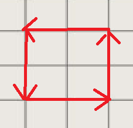
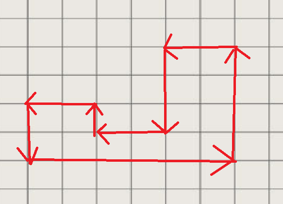

# Day 5: Musesteg

Julenissen er livredd for krakk i boligmarkedet. Han har fått kalde føtter, og bestemt seg for å selge huset på nordpolen. For å legge ut annonse på finn.no må han måle bruksarealet av huset. Huset hans er latterlig stort, så han har derfor satt husmusen på saken.

Husmusen løper langs alle vegger og rapportrerer sin rute tilbake til julenissen. Ruta er en streng med retninger som musa har forflyttet seg, Der:

```
H = høyre
V = venstre
O = opp
N = ned
```

Husmusen beveger seg 1m for hver forflytning raportert i ruta, og vil ikke på noe punkt krysse ruta før hele ruta er målt opp. Ruta vil omslutte et lukket område.

## Oppgave

Hva er arealet av julenissens hus ut ifra husmusens rute gitt i [rute.txt](./rule.txt)?

For ruta HHOOVVNN får man et kvadrat på 2x2 med areal på 4:



For ruta HHHHHHOOOOVVNNNVVOVVNN får man et areal på 14

